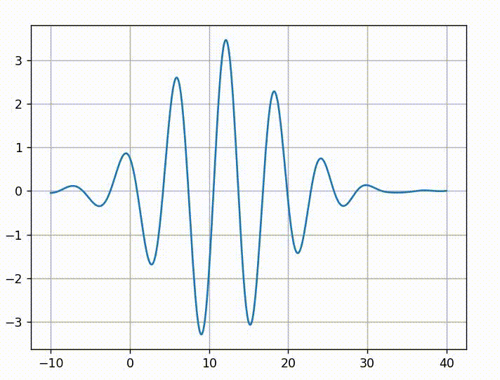

# Modern Physics - PHYS212
**Course description:** The course is a survey of modern physics, including topics such as relativity, electromagnetic radiation behaving as particles and matter behaving waves, introduction to quantum mechanics, atomic and
condensed matter physics, nuclear and particle physics and cosmology.

# Images
## Wave evolution (fourier)

